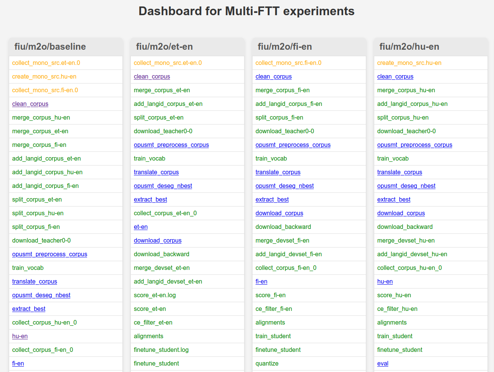

# Multi-FTT Dashboard

Dashboard, initially developed for the [Firefox Training Pipeline](https://github.com/GreenNLP/firefox-translations-training) and displays the logs of selected experiments.



This dashboard has been inspired by the [ParaCrawl Dashboard](https://github.com/hplt-project/paracrawl-dashboard).

## Installation
Just clone the repository somewhere with Python 3.8 and install Flask.

## Usage
This is an example of my set-up.

Have a script, say run-dashboard.sh, in the same folder as the dashboard.py script itself:

```bash
#!/bin/bash
source dashboard_venv/bin/activate #Should include python and flask
python dashboard.py
```

You should modify the corresponding paths in `dashboard.py`.

Then, connect an ssh session with port forwarding:

```bash
ssh -L 5000:127.0.0.1:5000 you@your.cluster
```

From that session, then start your run-dashboard.sh.

It should now say something like:

```
 * Running on http://127.0.0.1:5000
```

and you can connect your browser to http://127.0.0.1:5000 and get the interface if everything works.